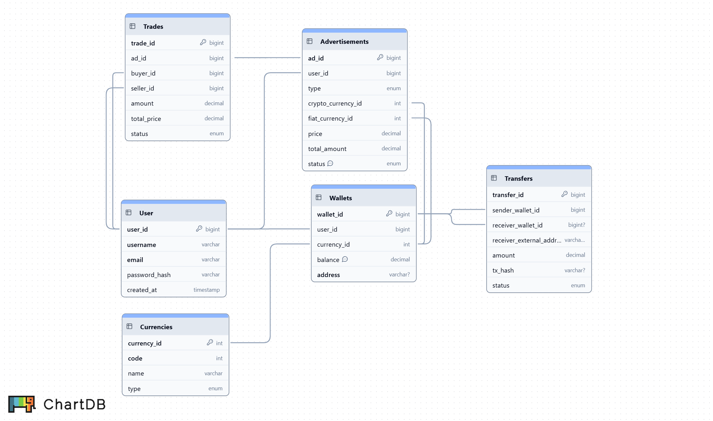

# P2P Cryptocurrency Exchange API

This is the backend API for a peer-to-peer crypto exchange platform, built for a technical assessment.

Users can create advertisements to buy or sell cryptocurrencies with fiat currency, and other users can initiate trades based on these ads. The system records all transaction history.

## ![ER Diagram]


## Features

- View all active advertisements.
- Create new advertisements.
- Initiate a trade from an existing advertisement.
- View details of a specific trade.
- Update the status of a trade (e.g., confirm payment).
  
## Technologies Used

- **Backend**: Node.js, Express.js
- **ORM**: Sequelize
- **Database**: MySQL 8.0
- **Containerization**: Docker, Docker Compose
- **Password Hashing**: bcrypt.js

## Prerequisites

- Node.js (v18.x or higher)
- Docker and Docker Compose

## Installation & Setup

1.  **Clone the repository**
    ```sh
    git clone <Your-GitHub-Repository-URL>
    cd <project-folder-name>
    ```

2.  **Install dependencies**
    ```sh
    npm install
    ```

3.  **Setup environment file**
    Copy the `.env.example` file to a new `.env` file and fill in your database credentials.
    ```sh
    cp .env.example .env
    ```
    **Example `.env` file:**
    ```env
    DB_HOST=127.0.0.1
    DB_PORT=3306
    DB_USER=root
    DB_PASS=your_secret_password
    DB_NAME=p2p_exchange_db
    DB_DIALECT=mysql
    PORT=3000
    ```
    **Important:** The `DB_PASS` and `DB_NAME` values must match what is defined in your `docker-compose.yml` file's environment section.

## Running the Project

Follow these steps in order:

1.  **Start the database service**
    ```sh
    docker-compose up -d
    ```

2.  **Run database migrations** (This creates all tables)
    ```sh
    npx sequelize-cli db:migrate
    ```

3.  **Seed the database with test data**
    ```sh
    npx sequelize-cli db:seed:all
    ```

4.  **Start the application server**
    ```sh
    node app.js
    ```
    The server will be running at `http://localhost:3000`.

##  API Endpoints

Here are the main API endpoints available in this project.

**1. Get All Advertisements**
- **Method**: `GET`
- **URL**: `/api/advertisements`
- **Description**: Retrieves a list of all `ACTIVE` advertisements.
- **Success Response (200)**:
  ```json
  [
      {
          "id": 1,
          "type": "SELL",
          "price": "950000.00",
          "total_amount": "0.500000000000000000",
          "status": "ACTIVE",
          "User": { "username": "seller_a" },
          "crypto": { "code": "BTC" },
          "fiat": { "code": "THB" }
      }
  ]

**2. Create New Advertisement**
- **Method**: `POST`
- **URL**: `/api/advertisements`
- **Description**: สร้างประกาศซื้อ/ขายใหม่
- **Success Response (200)**:
  ```json
  [
    {
    "type": "SELL",
    "cryptoCurrencyId": 3,
    "fiatCurrencyId": 1,
    "price": "960000.00",
    "total_amount": "0.25"
    }
  ]

**3. Create New Trade**
- **Method**: `POST`
- **URL**: `/api/trades`
- **Description**: เริ่มทำรายการซื้อขายใหม่โดยอ้างอิงจาก id ของประกาศ
- **Success Response (200)**:
  ```json
  [
    {
    "adId": 1,
    "amount": "0.1"
    }
  ]

**4. Get Trade Details by ID**
- **Method**: `GET`
- **URL**: `/api/trades/:id`
- **Description**: ดูรายละเอียดของรายการซื้อขาย 1 รายการ
- **URL Parameters**: id (required) - ID ของ Trade ที่ต้องการดู (เช่น /api/trades/1)

**5. Update Trade Status**
- **Method**: `PATCH`
- **URL**: `/api/trades/:id`
- **Description**: อัปเดตสถานะของรายการซื้อขาย
- **URL Parameters**: id (required) - ID ของ Trade ที่ต้องการดู (เช่น /api/trades/1)
- **Success Response (200)**:
  ```json
  [
    {
    "status": "PAID"
    }
  ]
